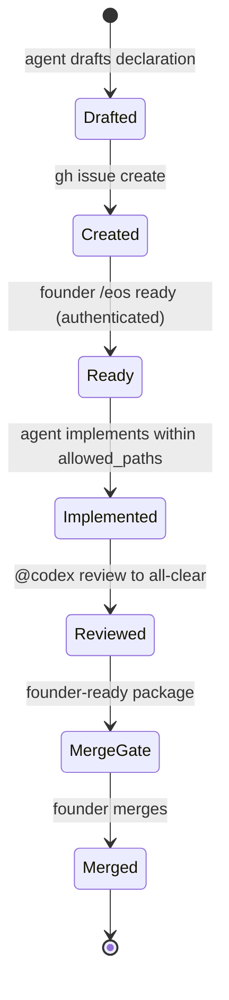
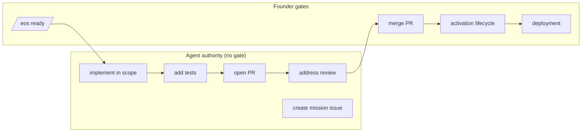
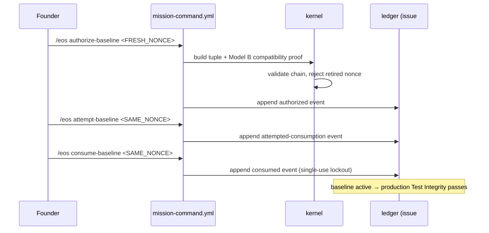
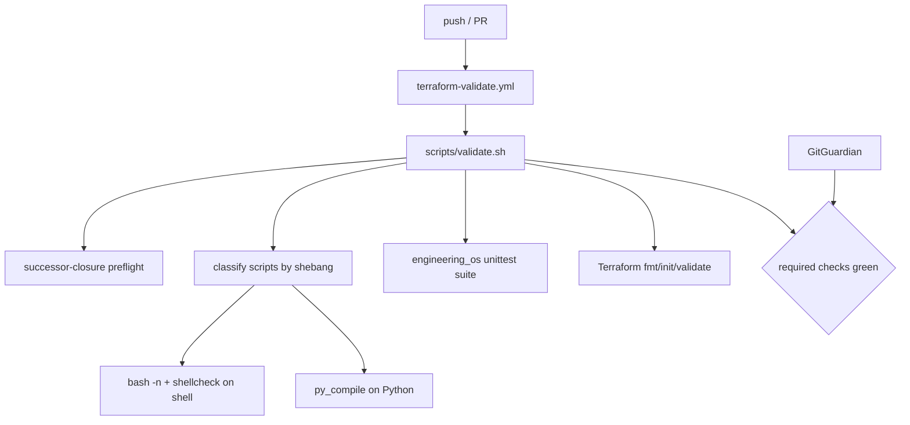

# EOS Architecture

**Status:** current · **Applies to:** `main` at the merge that adds this document · **Audience:** engineers and AI agents.

The Engineering Operating System (EOS) is the governance and validation layer of the AIFO Control Plane. It turns "who may change what, and on what evidence" into authenticated, fail-closed, machine-checkable rules. This document describes its components and its data, lifecycle, governance, activation, and validation flows.

> Authority note: Git object identities (commit, tree, blob SHAs) and authenticated EOS event hashes are authoritative. Prose and diagrams here are explanatory.

---

## 1. Major components

| Component | Path | Role |
|---|---|---|
| Command kernel | `engineering_os/commands.py` | Parses `/eos` commands, authenticates event history, validates the activation ledger and the Model B compatibility chain, builds event proposals. Pure — no persistence. |
| Mission model | `engineering_os/mission.py` | Parses and validates mission declarations; computes the declaration digest. |
| State projection | `engineering_os/state.py` | Projects mission lifecycle state from the authenticated event chain. |
| Audit + schema | `engineering_os/audit.py`, `engineering_os/schema.py`, `schemas/engineering-os/*.json` | Canonical hashing, event/document schema validation. |
| Test Integrity | `engineering_os/test_integrity.py`, `engineering_os/test_integrity_cli.py` | Analyzes the governed test corpus; establishes the reviewed baseline. **Invariant surface** (must not drift for the compatibility chain to hold). |
| Mission command workflow | `.github/workflows/mission-command.yml` | The only writer of authenticated events. Runs on `issue_comment`, re-authenticates history, appends the proposed event. |
| Required validation | `.github/workflows/terraform-validate.yml` → `scripts/validate.sh` | The required branch-protection gate. Classifies scripts, runs tests, closure, and Terraform validation. |
| Closure + successor validation | `scripts/engineering-os/validate-activation-closure` | Bounds what a successor commit may change past the reviewed closure; pins exact content. |
| Readiness snapshot | `outputs/eos-activation-readiness/*`, `scripts/engineering-os/validate-activation-readiness` | Immutable pre-authorization checkpoint + deterministic cross-field validator. |

---

## 2. Component and data flow

```mermaid
flowchart TD
    Founder([Founder]) -->|/eos comment| MC[mission-command.yml]
    Agent([Engineer / AI agent]) -->|PR + code| PR[Pull Request]
    MC -->|authenticate history| K[command kernel<br/>engineering_os/commands.py]
    K -->|validate| LED[(activation ledger<br/>authenticated events)]
    K -->|validate| CHAIN[Model B compatibility chain]
    MC -->|append event| ISSUE[(GitHub issue<br/>event comments)]
    PR --> CI{Required CI<br/>validate.sh}
    CI -->|classify + test| VAL[tests, closure,<br/>Terraform]
    CI --> REV[@codex review]
    REV -->|all-clear| GATE{Founder merge gate}
    GATE -->|approve| MAIN[(main)]
```

The **only** component that writes authenticated events is the mission-command workflow. Everything in the kernel is a pure validator: it consumes an already-authenticated event history and never persists.

---

## 3. Mission lifecycle flow



A mission's scope is fixed by its **Ready-bound declaration**. An agent may only touch `allowed_paths`; `prohibited_paths` fail closed. The `/eos ready` event is founder-authenticated and binds the exact declaration digest.

---

## 4. Governance flow



Agents have broad authority **inside** a Ready-bound scope. Founder gates are: posting `/eos ready`, merging a PR, every activation-lifecycle command, and deployment.

---

## 5. Activation flow (founder-controlled; documented, not executed)



See `EOS_OPERATIONS_RUNBOOK.md` for the step-by-step runbook. No real nonce appears in any document.

---

## 6. Validation flow (required CI)



The two **required** branch-protection contexts are `Validate Terraform` and `GitGuardian Security Checks`. `Test Integrity` is informational and remains fail-closed at the pre-activation boundary until the baseline is activated.

---

## 7. The Model B compatibility chain (why activation is safe)

The reviewed Test Integrity baseline was generated at a historical commit. The default branch has since advanced. Rather than regenerate the baseline (which would cover an un-reviewed corpus), the kernel proves a **compatibility chain**: it enumerates every commit from the reviewed baseline to the active head and checks that the baseline-generator/analyzer **invariant surface** is byte-identical at each one. Merge parents that predate the baseline are declared and verified as ancestors; the range is validated as a DAG. Ancestry alone, final-tree equality alone, and cyclic histories are all rejected.

Retired activation nonces are permanently reserved and rejected fail-closed at both proposal time and ledger-validation time.

See `EOS_VERSION_1_FINAL_REPORT.md` §Governance History for how each of these guarantees was built (Missions #35, #36, #38).
