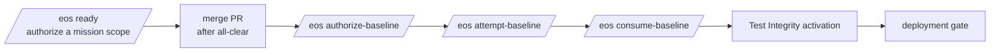

# EOS Founder Guide

**Status:** current · **Audience:** the founder (the only actor who can post authenticated `/eos` governance events and merge).

This guide explains exactly when you are involved and, for every founder command, its purpose, prerequisites, expected output, how to validate it afterward, and rollback behavior.

> Every `/eos` command you post is an **authenticated, founder-signed event**. Post it only when you genuinely intend that authorization. An AI agent must never post these on your behalf without your explicit, unambiguous instruction.

---

## 1. When you are involved

You are involved at exactly these gates:

Everything else — drafting missions, implementing, testing, reviewing, opening PRs — is done autonomously by engineers/AI agents inside a Ready-bound scope.

---

## 2. Founder commands

### `/eos ready` (on a mission issue)
- **Purpose:** authenticate a mission's declared scope so implementation may begin. This is the founder's signature on "these `allowed_paths` may change, under this declaration."
- **Prerequisites:** the mission issue exists; its live declaration digest matches the drafted digest; it is schema-valid and `validate_ready`-clean; no prior Ready event exists on it.
- **Expected output:** the mission-command workflow appends a `mission.ready` event (actor_role `founder`) whose `details.mission_sha256` equals the declaration digest.
- **Validate after:** recompute the event hash; confirm it binds the exact declaration digest; confirm schema and event-chain validity.
- **Rollback:** none needed — Ready authorizes scope but changes no code. If a mission is abandoned, simply do not implement or merge it.

### Merge a PR
- **Purpose:** integrate a completed, reviewed mission into `main`.
- **Prerequisites:** required CI green (`Validate Terraform`, `GitGuardian`); exact-head `@codex review` all-clear (👍 + "Didn't find any major issues" bound to the exact head); 0 unresolved threads; the head/tree/base match the package; the branch is a clean descendant of `main`.
- **Expected output:** a merge commit whose first parent is the prior `main`, second parent is the PR head, and merged tree equals the PR head tree.
- **Validate after:** verify both parents and the merged tree; confirm `main` points to the merge commit; re-run post-merge validation.
- **Rollback:** revert to the recorded rollback SHA (the prior `main`). No authenticated event is affected.
- **Recommendation:** use a **merge commit** with an exact-head guard; never squash, rebase, amend, or force-push.

### `/eos authorize-baseline <FRESH_NONCE>` (on issue #26)
- **Purpose:** authorize activation of the reviewed Test Integrity baseline against the current default branch.
- **Prerequisites:** an authenticated Mission #26 Ready event exists; the compatibility chain validates on the current `main`; you supply a **fresh** high-entropy nonce (≥ 32 chars, charset `[A-Za-z0-9._:-]`) that has never been used. **The historical retired nonce is permanently rejected** (`ACTIVATION_NONCE_RETIRED`).
- **Expected output:** a `test_integrity.baseline.authorized` event that separates historical baseline identity from active-execution identity and carries a valid Model B compatibility proof.
- **Validate after:** authenticate the event; confirm identity separation and the compatibility proof; confirm exactly one authorization exists.
- **Rollback / recovery:** a *structurally superseded* (pre-identity-separation) authorization is reported terminally, can never be attempted/consumed, and can be **replaced** by a fresh authorization without rewriting history. A *usable* authorization, by contrast, cannot be re-issued while it exists (`ACTIVATION_AUTHORIZATION_REPLAY`), and if `main` advances past it, attempt/consume fails closed (`ACTIVATION_COMMIT_MISMATCH`) with no in-band re-authorization. **Do not advance `main` between authorize and consume**; complete the three steps against a stable head. Recovering from a stranded usable authorization is a founder governance decision — the model fails closed rather than silently re-binding.

### `/eos attempt-baseline <SAME_NONCE>` (on issue #26)
- **Purpose:** perform the authenticated attempted-consumption step.
- **Prerequisites:** a valid, current authorization exists using the same nonce; the default branch has not advanced past the authorized execution identity.
- **Expected output:** a `test_integrity.baseline.consumption_attempted` event, state `locked`.
- **Validate after:** authenticate the attempted-consumption event and its workflow provenance.
- **Rollback:** none; the attempt locks the tuple. If it fails closed, no event is appended.

### `/eos consume-baseline <SAME_NONCE>` (on issue #26)
- **Purpose:** finalize activation (single-use lockout).
- **Prerequisites:** an authenticated attempt exists for the same nonce.
- **Expected output:** a `test_integrity.baseline.consumed` event, state `active`; permanent single-use lockout (a second authorization/attempt/consume and any nonce reuse fail closed).
- **Validate after:** authenticate the consumed event; confirm baseline activation; confirm lockout by attempting a reuse (expected to fail closed).
- **Rollback:** activation is intentionally terminal. Recovery would require a separately governed recovery/supersession event; there is no silent reset.

### Test Integrity activation verification
- **Purpose:** confirm production Test Integrity passes on the activated default branch (it is fail-closed pre-activation by design).
- **Prerequisites:** consumption completed.
- **Expected output:** Test Integrity `allowed: true` on `main`.

### Deployment
- **Separate gate.** Not exercised by any EOS mission. Deployment record `5528959623` remains `inactive` (an accidental API-audit artifact; do not delete it).

---

## 3. What you should never be asked to skip

- Do not merge without exact-head all-clear.
- Do not reuse the retired nonce (the system rejects it, but do not attempt it).
- Do not authorize/attempt/consume out of order or across a branch advance.
- Do not deploy as part of activation.

If an agent asks you to post `/eos ready` or approve a merge, it must present a complete package with the exact digests, head/tree, CI, and review evidence. If any of that is missing or an agent tries to proceed without it, decline.
