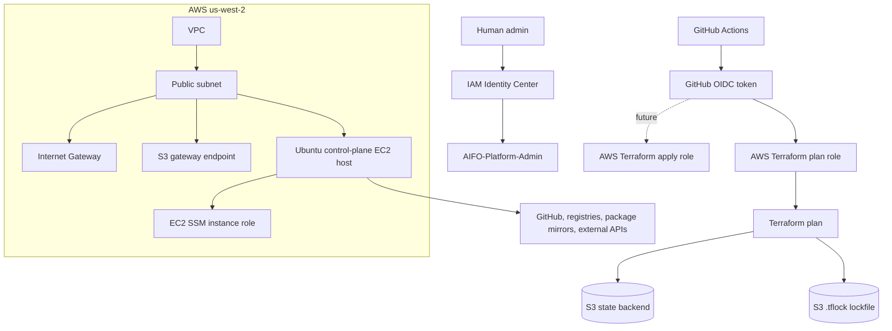

# Architecture

## Purpose

The AI.FO control plane provides a minimal AWS foundation for running a single administrative host and future platform services. This initial repository focuses on secure defaults, repeatable Terraform planning, and deployment guardrails.

## Constraints

- AWS account already exists.
- Root MFA is enabled.
- IAM Identity Center is enabled.
- Human admin permission set is `AIFO-Platform-Admin`.
- GitHub Actions OIDC will be used for automation.
- AWS region is `us-west-2`.
- Monthly budget target is `$250`.
- EC2 administrative access must use Systems Manager Session Manager.
- No public inbound network access is allowed.
- No long-lived AWS keys are allowed.
- No committed secrets are allowed.
- The initial host must reach the public internet for package installs, GitHub, container registries, and external APIs.

## High-Level Design

## Network

The initial network is deliberately small:

- One VPC.
- One public subnet in one Availability Zone by default.
- One Internet Gateway.
- Public IPv4 address assigned to the control-plane host.
- Zero inbound security-group rules on the host.
- Outbound HTTPS to the internet.
- Outbound DNS to the VPC resolver.
- S3 gateway endpoint retained for private S3 routing where AWS route selection applies.

This is a cost-conscious initial design. A private subnet with NAT Gateway would meet the same egress requirement but adds recurring NAT Gateway hourly and data-processing cost. A public IPv4 address with no inbound security-group rules gives the host the required outbound access while preserving the SSM-only administrative model.

Private subnets, NAT, and interface VPC endpoints are deferred until there is a clearer operational need and budget justification.

## Compute

The control-plane host is modeled as a single Ubuntu EC2 instance:

- Default type: `m7i-flex.2xlarge`
- Target capacity: 8 vCPU, 32 GiB RAM
- Public IPv4 address for outbound internet access
- No SSH key pair
- No inbound security-group rules
- IAM instance profile with `AmazonSSMManagedInstanceCore`
- IMDSv2 required
- Encrypted GP3 root volume
- Termination protection enabled by default

Instance type candidates pending pricing and availability verification:

- `m7i-flex.2xlarge`
- `m7i.2xlarge`
- `m7a.2xlarge`

## IAM

Human administration is outside Terraform for this initial baseline and is handled by IAM Identity Center.

Terraform defines the EC2 instance role needed for Systems Manager in the control-plane environment.

Bootstrap Terraform defines:

- GitHub OIDC provider.
- Terraform plan role.
- Terraform apply role reserved for a future protected apply workflow.

Both GitHub Actions roles must trust only the exact repository and protected GitHub environment. The apply role is not used by any current workflow.

## Terraform State

The Terraform environment is prepared for an S3 backend with native S3 lockfiles:

- S3 state bucket
- Server-side encryption
- Versioning on the bucket
- Block Public Access
- `use_lockfile = true`

DynamoDB locking is avoided because current Terraform S3 backends support native lockfiles. Terraform `>= 1.10.0` is required.

## Cost Controls

An AWS Budget already exists manually, so Terraform budget management defaults to disabled with `manage_budget = false`.

Cost-sensitive design choices:

- No NAT Gateway in the initial network baseline.
- No interface VPC endpoints in the initial baseline.
- One subnet in one Availability Zone by default.
- One EC2 host by default.
- Root volume defaults are explicit and configurable.

## Architecture Decisions

### ADR-001: Use Session Manager Instead of SSH

**Status:** Accepted

EC2 administration will use Systems Manager Session Manager. The host has no SSH key pair and no inbound security-group rules. This reduces public attack surface and removes SSH key management from the baseline.

### ADR-002: Use GitHub Actions OIDC for CI/CD AWS Access

**Status:** Accepted

GitHub Actions will assume AWS roles through OIDC. Static AWS access keys are not allowed in GitHub secrets. Plan and apply roles are separate and scoped to protected GitHub environments.

### ADR-003: Start With Public Subnet Egress Instead of NAT Gateway

**Status:** Accepted

The host needs outbound internet access to install packages, clone GitHub repositories, pull containers, and call external APIs. A public IPv4 address with no inbound rules satisfies that requirement at lower initial cost than NAT Gateway. Private subnet migration is deferred to a later phase.

### ADR-004: Use Native S3 State Lockfiles

**Status:** Accepted

Terraform state uses the S3 backend with `use_lockfile = true`. DynamoDB locking is not used unless a future Terraform compatibility requirement forces it.
