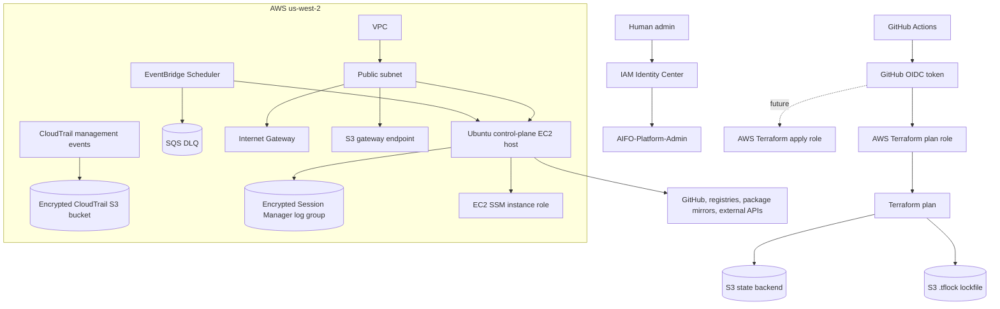

# Architecture

## Purpose

The AI.FO control plane provides a minimal AWS foundation for infrastructure operations. This initial repository focuses on secure defaults, repeatable Terraform planning, and deployment guardrails. It does not yet host the AI.FO product runtime.

## Constraints

- AWS account already exists.
- Root MFA is enabled.
- IAM Identity Center is enabled.
- Human admin permission set is `AIFO-Platform-Admin`.
- GitHub Actions OIDC will be used for automation.
- AWS region is `us-west-2`.
- Monthly budget target is `$250`.
- EC2 administrative access must use Systems Manager Session Manager.
- No public inbound network access is allowed.
- No long-lived AWS keys are allowed.
- No committed secrets are allowed.
- The initial host must reach the public internet for package installs, GitHub, container registries, and external APIs.
- The existing AI.FO product runtime requirements must guide infrastructure design.

## High-Level Design

## Network

The initial network is deliberately small:

- One VPC.
- One public subnet in one Availability Zone by default.
- One Internet Gateway.
- Public IPv4 address assigned to the control-plane host.
- Zero inbound security-group rules on the host.
- Outbound HTTPS to the internet.
- Outbound DNS to the VPC resolver.
- S3 gateway endpoint retained for private S3 routing where AWS route selection applies.

This is a cost-conscious initial design. A private subnet with NAT Gateway would meet the same egress requirement but adds recurring NAT Gateway hourly and data-processing cost. A public IPv4 address with no inbound security-group rules gives the host the required outbound access while preserving the SSM-only administrative model.

Private subnets, NAT, and interface VPC endpoints are deferred until there is a clearer operational need and budget justification.

## Compute

The control-plane host is modeled as a single Ubuntu EC2 instance:

- Default type: `m7i-flex.2xlarge`
- Target capacity: 8 vCPU, 32 GiB RAM
- Default root volume: 100 GiB encrypted gp3
- Public IPv4 address for outbound internet access
- No SSH key pair
- No inbound security-group rules
- IAM instance profile with `AmazonSSMManagedInstanceCore`
- IMDSv2 required
- Encrypted GP3 root volume
- Termination protection enabled by default
- Detailed monitoring disabled by default until monitoring requirements justify it
- Session Manager session logging enabled through account preferences
- EventBridge Scheduler starts the host at 08:00 and stops it at 16:00 Monday-Friday in `America/Los_Angeles`

Instance type candidates pending pricing and availability verification:

- `m7i-flex.2xlarge`
- `m7i.2xlarge`
- `m7a.2xlarge`

Current recommendation: keep `m7i-flex.2xlarge` as the default x86 candidate, but approve it only for scheduled operation under the $250 monthly budget. Continuous operation requires a separate budget exception. See [ec2-instance-recommendation.md](ec2-instance-recommendation.md).

## IAM

Human administration is outside Terraform for this initial baseline and is handled by IAM Identity Center.

Terraform defines the EC2 instance role needed for Systems Manager in the control-plane environment.

Bootstrap Terraform defines:

- GitHub OIDC provider.
- Terraform plan role.
- Terraform apply role exists for the future OIDC boundary but currently has only Terraform state access.

Both GitHub Actions roles trust only the exact repository and GitHub environment subject. GitHub required environment reviewers are unavailable on the current repository plan, so the `terraform-apply` environment exists but must remain unused. No apply workflow may be created until reviewer protection is available or a replacement approval boundary is accepted.

Until then, a control-plane apply must be run only from an authenticated IAM Identity Center session after a reviewed approval packet.

## Audit And Operations

The first deployable control-plane plan now includes:

- Multi-Region CloudTrail trail for management events only.
- CloudTrail log-file validation enabled.
- Dedicated S3 bucket for CloudTrail logs with server-side encryption, versioning, public access blocked, TLS-only access, CloudTrail-only writes, and 365-day lifecycle expiration.
- No CloudTrail data events.
- CloudWatch Logs group for Session Manager session logs with customer-managed KMS encryption and 30-day retention.
- SSM Session Manager preferences document `SSM-SessionManagerRunShell`.
- EC2 instance-role inline policy permitting session log writes and use of the Session Manager KMS key.
- EventBridge Scheduler schedules for host start/stop, scoped to the single instance ARN.
- Scheduler dead-letter queue with SQS-managed encryption and 14-day message retention.

The EC2 host is created running for first-session verification. Terraform does not manage a permanent stopped state because that would conflict with the approved operating schedule and routine daytime plans. The first apply should be scheduled inside the approved operating window; if deployment occurs outside it, the operator must stop the instance manually after verification.

Because EC2 releases auto-assigned public IPv4 addresses while an instance is stopped, Terraform ignores drift on `aws_instance.host.associate_public_ip_address`. The next start assigns a new public IPv4 address for outbound internet access. Session Manager administration must not depend on a stable public address, and an Elastic IP is deliberately omitted to avoid unnecessary cost.

## Terraform State

The Terraform environment is prepared for an S3 backend with native S3 lockfiles:

- S3 state bucket
- Server-side encryption
- Versioning on the bucket
- Block Public Access
- `use_lockfile = true`

DynamoDB locking is avoided because current Terraform S3 backends support native lockfiles. Terraform `>= 1.10.0` is required.

## Cost Controls

An AWS Budget already exists manually, so Terraform budget management defaults to disabled with `manage_budget = false`.

Cost-sensitive design choices:

- No NAT Gateway in the initial network baseline.
- No interface VPC endpoints in the initial baseline.
- One subnet in one Availability Zone by default.
- One EC2 host by default.
- Root volume defaults are explicit and configurable.
- Detailed EC2 monitoring defaults to disabled.
- The example root volume is 100 GiB gp3.
- CloudTrail logs expire after 365 days.
- Session Manager logs expire after 30 days.
- Session Manager uses one customer-managed KMS key; this is a deliberate fixed cost for explicit encryption and auditability.

Operating schedules for the default host:

- 8 hours per weekday: recommended first deployment posture.
- 12 hours per day: acceptable if the longer work window is approved.
- Always on: not approved under the current $250 budget.

## Architecture Decisions

Material decisions are recorded in [docs/adr/](adr/). Accepted ADRs cover the deployed control plane. Proposed ADR-0011 through ADR-0022 cover the unapproved product runtime.

## Proposed Product Runtime Architecture

The repository-grounded recommendation for the first approximately 10 customer companies is documented in [product-runtime-reference-architecture.md](product-runtime-reference-architecture.md). It is a design, not deployed state:

- Current Organizations management account retains control/nonproduction; one dedicated member account isolates production.
- CloudFront and WAF serve a private-S3 React build and route same-origin `/api/*` to an ALB.
- Two private ECS Fargate API tasks span two Availability Zones.
- Private RDS PostgreSQL Multi-AZ stores product and PostgreSQL session state.
- Private versioned S3 replaces R2 as the production object authority after checksum-validated migration.
- Secrets Manager, ECS task roles and GitHub OIDC avoid long-lived AWS credentials.
- CloudWatch/CloudTrail/GuardDuty provide a minimal unified evidence plane.
- A simple SQS worker is deferred until current synchronous jobs are idempotent and measured evidence requires it.

Kubernetes, microservices, Aurora, Redis and active-active multi-Region are deliberately deferred. Expected product-runtime beta cost is `$400-$550/month`, separate from the existing `$250` control-plane target; founder recurring-cost approval is required.

No product runtime, database, bucket, secret, domain, certificate, callback or customer data is created or moved by the architecture package.
