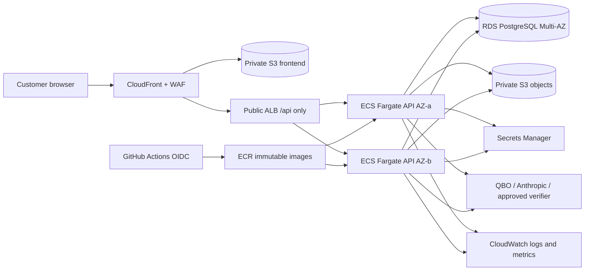

# Product Runtime Reference Architecture

Date: 2026-07-15

Status: AWS-managed strategic direction approved; topology details and implementation parameters remain Proposed; nothing is deployed

## Recommendation At A Glance

The approved direction is a small, managed, founder-operable AWS runtime before real customer data. The review baseline proposes a dedicated production member account, CloudFront/private S3, an ALB with ECS Fargate API tasks, RDS PostgreSQL, private S3 objects, PostgreSQL sessions, Secrets Manager and task roles. Those service/topology parameters remain Proposed until prerequisite and cost evidence is reviewed. Add a simple SQS worker only after synchronous jobs are made durable and measured.

No Kubernetes, service mesh, Aurora, Redis, microservice split, or always-on control-plane host is justified for 10 companies.

Merged product PR #186 does not require a different core topology. Its connector/account implementation adds Stripe HTTPS egress, aggregate `external_connections`/`source_observations` data in PostgreSQL, a Stripe secret and tenant binding in the secret model, and connector/account rows in backup, restore, tenant-isolation, audit and deletion gates. Exact RDS size, NAT topology, hostname, RPO/RTO, PITR retention and monthly budget remain Proposed because the merge supplies no sizing or recovery evidence.

## Environment And Account Model

| Environment | Account | Availability | Data |
| --- | --- | --- | --- |
| Local | Developer workstation | Best effort | Synthetic only |
| Development/preview | Existing management/nonproduction account or local ephemeral environment | Best effort | Synthetic only |
| Staging | Existing management/nonproduction account, dedicated VPC/resources | Business-hours validation | Synthetic or approved sanitized fixtures only |
| Production | New dedicated organization member account | 99.5% objective | Real customer data |

Two accounts are the minimum useful boundary, not a complex account program. The existing account is the Organizations management account, so placing customer production there would mix organization authority, control-plane infrastructure, nonproduction work, and customer data. A dedicated member account limits blast radius and makes founder recovery/contractor access easier to reason about. Additional per-customer or per-environment accounts are deferred.

The production account decision is founder-approved before infrastructure design freeze. Account creation, IAM changes, and resource creation are outside this mission.

## Network Topology

Production uses one VPC across two Availability Zones:

- Two public subnets for the ALB and NAT gateways.
- Two private application subnets for Fargate tasks.
- Two private database subnets for RDS.
- No public database address and no route from the internet to application tasks.
- ALB security group accepts 443 only from CloudFront using the AWS-managed CloudFront origin-facing prefix list and a secret origin header where supported.
- API security group accepts the application port only from the ALB security group.
- DB security group accepts PostgreSQL only from the API and approved migration-task security groups.
- Two NAT gateways, one per AZ, preserve production egress when an AZ fails and avoid routine cross-AZ NAT dependency. This is a deliberate roughly `$66/month` availability cost before data processing.
- S3 gateway endpoint routes S3 access without NAT cost. Interface endpoints are added only when their security benefit exceeds their per-AZ hourly cost; Secrets Manager, ECR, and CloudWatch can initially use controlled NAT egress.
- Network ACLs remain simple defaults; security groups and workload IAM carry the policy.

Staging may use one NAT or a public-IP Fargate task whose security group accepts inbound only from its ALB. The latter reduces fixed cost while retaining no direct application ingress; it is not the production design.

Outbound allowlisting by hostname is not natively enforceable with security groups. QBO and model providers use changing public endpoints. Start with HTTPS egress through NAT, DNS/query/flow visibility, workload-level destination configuration, and alerting. Add an egress proxy/firewall only if incident evidence or compliance justifies its cost and operational burden.

## Frontend

### Decision

Build the existing Vite SPA once, upload the immutable output to a private versioned S3 bucket, and serve it through CloudFront with Origin Access Control. Route `/api/*` on the same distribution to the ALB. Use explicit cache policies: hashed assets long-lived/immutable, HTML short-lived with controlled invalidation.

### Alternatives

- Existing hosting: fastest, but preserves an external deployment plane and complicates atomic release/rollback.
- Amplify Hosting: capable, but adds a separate build/deploy abstraction where the existing build is already simple.
- Container-hosted frontend: wastes API compute and couples static availability to API releases.

Same-origin routing preserves current relative API calls, session-cookie behavior, CORS simplicity, and QBO callback shape. A frontend release is a versioned object prefix plus a CloudFront origin/version switch; the previous prefix remains available for rollback.

## API Compute

### Decision

- ECS Fargate service, Linux ARM64 if the lockfile/build proves all dependencies support it; otherwise x86 initially.
- Two tasks minimum, one per AZ, initially 0.5 vCPU/1 GiB each. Raise to 1 vCPU/2 GiB based on load/memory evidence.
- Internet-facing ALB, target health on a new readiness endpoint, deregistration delay, graceful SIGTERM shutdown, and deployment circuit breaker with rollback.
- Immutable ECR image referenced by digest, read-only root filesystem where application behavior permits, non-root user, dropped Linux capabilities, no privileged mode, ephemeral storage bounded.
- Separate execution role for image/log/secret injection and task role for precise runtime S3/Secrets/KMS/telemetry actions.
- Autoscale at two to four tasks based on CPU/memory and ALB request/latency evidence. Do not scale to zero in production.

ECS can pin service revisions to image digests and automatically roll back failed rolling deployments through its [deployment failure controls](https://docs.aws.amazon.com/AmazonECS/latest/developerguide/deployment-type-ecs.html).

### Alternatives

- App Runner: simpler initial service, but offers less explicit deployment/network/egress control and does not reduce the database/storage/migration burden.
- Elastic Beanstalk: workable, but its environment abstraction and instance lifecycle are unnecessary when the artifact is a container.
- EC2: repeats host patching/capacity burden and weakens founder operability.
- Lambda: current Express process, PostgreSQL sessions/pool, synchronous long QBO/AI flows, and startup work do not fit without significant redesign.
- Kubernetes: rejected as unjustified operational overhead.

### Background Work

Do not create microservices immediately. First make QBO sync, upload processing, and narrative generation idempotent with durable job identifiers. When request durations or retries require it, add one SQS queue and a second ECS service running the same image in worker mode, with a dead-letter queue and per-job audit state. Scheduler can enqueue bounded refresh/maintenance work. The API remains the only public service.

## Database

### Decision

Use RDS PostgreSQL Multi-AZ DB instance with one synchronous standby, not Aurora or the three-instance Multi-AZ DB cluster.

- Initial class: `db.t4g.medium` (2 vCPU, 4 GiB) after ARM extension compatibility validation. `db.t4g.small` is a cost fallback only if load/memory testing passes.
- 50 GiB encrypted gp3, storage autoscaling with a reviewed maximum, deletion protection, and no public access.
- Current supported PostgreSQL major version with a documented upgrade calendar; avoid Extended Support charges.
- 35-day automated backup/PITR, daily backup window outside customer peak, weekly maintenance window, and monthly retained snapshots.
- Performance Insights/Database Insights and Enhanced Monitoring at a modest interval; alarms for CPU, free memory/storage, connections, replica/failover/backup events, and long-running transactions.
- Application pool explicitly bounded per task so total connections remain below a safe database threshold. Add RDS Proxy only if measured scaling/connection churn requires it.
- TLS required with AWS CA validation. Database credentials come from Secrets Manager and rotate only after the application proves reconnection behavior.

Multi-AZ provisions a standby in another AZ and automatically fails over, per [RDS PostgreSQL deployment documentation](https://aws.amazon.com/rds/postgresql/pricing/). RDS automated backups support PITR and retention up to 35 days, per [AWS RDS backup guidance](https://docs.aws.amazon.com/prescriptive-guidance/latest/backup-recovery/rds.html).

### Why Not Aurora

The first cohort has low, predictable relational load. Aurora's additional abstraction and minimum capacity/cost do not solve a demonstrated requirement. Standard RDS PostgreSQL preserves familiar operations and is sufficient through the next 50 customers with vertical scaling and measured read/query improvements.

### Schema Controls

Before staging:

1. Select one migration tool and immutable migration ledger.
2. Remove startup DDL and non-fatal schema mutation.
3. Run migrations as a one-off, audited ECS task using a distinct migration role before application rollout.
4. Use expand/migrate/contract changes compatible with both old and new application versions.
5. Back up and verify restore point before destructive/large migrations.
6. Block deployment if migration, readiness, or schema-version checks fail.
7. Define forward-fix and PITR restore decision criteria; do not pretend every DB change can be rolled back in place.

## Object Storage

### Decision

Use S3 as the production source-file store. Keep R2 read-only for the current demo/migration window, then retire production credentials after reconciliation and retention approval.

- Separate staging and production buckets; production account ownership enforced.
- Block Public Access, bucket-owner-enforced object ownership, TLS-only bucket policy, no ACLs.
- SSE-KMS with a production object key and task-role-scoped encryption context.
- Versioning, lifecycle for incomplete multipart uploads/noncurrent versions, S3 Inventory, and checksums.
- Key format uses opaque tenant ID and object UUID; original filename is sanitized metadata, not the key.
- Upload to quarantine, enforce size/checksum, scan/validate, then copy/tag to accepted state. Parser processes only accepted objects.
- API streams or uses short-lived tenant-scoped presigned URLs; no public objects.
- CloudTrail data events for sensitive object access or equivalent S3 access logging with cost reviewed. AWS notes versioning, encryption and access logging in [S3 security guidance](https://docs.aws.amazon.com/AmazonS3/latest/userguide/security-best-practices.html).

### Migration

Create a content-free manifest containing source key, size, ETag when meaningful, SHA-256 calculated by a controlled migration task, destination key/version, and result. Perform initial copy, delta copy, source write freeze, final count/size/checksum reconciliation, application cutover, and read sampling. Do not use open-ended dual-write. No real objects are copied until explicit founder approval.

## Secrets And Key Management

Use Secrets Manager for database credentials, session-secret keyring, QBO client secret and token-encryption keyring, Anthropic key, Stripe restricted key or future tenant connector credentials, and any approved verifier credential. Parameter Store may hold nonsecret configuration only. The merged single `STRIPE_SECRET_KEY` plus `AIFO_STRIPE_COMPANY_ID` binding is a one-company guard, not the production credential model for 10 companies; provider authorization must be represented per tenant before multi-company use.

- Names and IAM policies are environment-specific and secret-specific.
- Tasks receive/retrieve only required secret versions through task roles; no wildcard list/read.
- CloudTrail records control-plane secret access. Secret values never appear in plans, task definitions, logs, error messages, or documentation.
- RDS credential automatic rotation is preferred after staging proves connection refresh.
- Vendor credential rotation is manual and dual-version where provider APIs require it; evidence records actor/time/version, not values.
- Session keyring supports active and previous verify keys for a bounded transition or intentionally invalidates every session during emergency rotation.
- QBO ciphertext includes `keyVersion`; a batched, idempotent re-encryption job validates decrypt-with-old/encrypt-with-new before retiring a key.
- Break-glass secret read requires founder MFA, reason, time-bound permission, CloudTrail evidence, and immediate follow-up rotation when plaintext was disclosed.

ECS task roles provide automatically rotated temporary AWS credentials, avoiding static AWS keys, per [AWS ECS IAM guidance](https://docs.aws.amazon.com/AmazonECS/latest/developerguide/security-iam-roles.html).

## Authentication And Sessions

Retain Passport Local and PostgreSQL-backed sessions for the cohort, subject to product hardening. Redis adds a new stateful dependency without demonstrated need.

- Separate production session table/schema; purge expired rows.
- Regenerate session on login/role change and explicitly destroy/clear on logout.
- Default-deny production CORS; same-origin CloudFront means no normal credentialed cross-origin request.
- Add CSRF tokens or strict custom-request-header/origin validation for state changes.
- Durable account rate limiting uses PostgreSQL or a managed edge/rate-based WAF control, not per-process memory.
- Founder/admin accounts require phishing-resistant MFA and audited access before launch.
- QBO callback remains same origin, TLS-only, exact registered path, session-state validated, and separated between sandbox staging and production credentials.

## Domain, DNS, And TLS

`ai.fo` is not currently an application domain; it redirects to a sale marketplace while application canonical tags claim it. Production must not depend on it until ownership and registrar recovery are proven.

Recommended domains:

- Production: `app.getaifo.com` unless founder proves and deliberately selects `ai.fo`.
- Staging: `staging.getaifo.com`, access-restricted and excluded from search.
- API remains same-origin under `/api`; ALB hostname is not customer-facing.

Founder controls registrar, DNS authority, billing, recovery email/phone, hardware MFA, and delegated operator access. Use Route 53 only after an approved DNS transfer/design; ACM certificates are DNS-validated and auto-renewed. Register exact Intuit sandbox/production callbacks, test before cutover, lower TTL in advance, preserve old callback during the allowed overlap, and define DNS/OAuth rollback. No DNS/certificate/callback change occurs in this mission.

## Logging And Observability

- CloudWatch Logs for ECS structured application logs, 30-day retention, KMS encryption, subscription/export only when justified.
- Separate 365-day security/audit stream with restricted writer/reader roles and integrity controls.
- ALB/CloudFront/WAF/S3 access evidence retained 90 days minimum; CloudTrail organization/production trail protected in the production security boundary.
- Metrics/alarms for CloudFront/ALB availability and latency, ECS task health/restarts, RDS resource/backup/failover, SQS age/DLQ when introduced, QBO/AI/verifier outcomes, upload pipeline, auth anomalies, and budget forecast.
- Every request receives a correlation ID; provider and job records carry it. Tenant is logged as a stable pseudonym, never company name.
- CloudWatch dashboard plus SNS/email/push escalation is enough initially. Defer third-party APM/tracing until evidence shows it materially improves diagnosis.
- Enable GuardDuty in production; triage high-severity findings. Use dependency/image scanning in CI/ECR. Defer Macie/Security Hub aggregation unless compliance or volume justifies it.

## Backup And Disaster Recovery

| Asset | Protection | Restore proof |
| --- | --- | --- |
| PostgreSQL | 35-day PITR, encrypted Multi-AZ, monthly 12-month snapshot; evaluate cross-Region automated-backup replication | Quarterly restore to isolated environment, schema/count/checksum/application smoke evidence |
| Customer objects | S3 versioning, checksums, noncurrent lifecycle, inventory; cross-Region copy only after residency/cost approval | Quarterly selected-object/version restore and manifest verification |
| Secrets | Secrets Manager versions, documented external-provider reset/reissue, QBO keyring backup under KMS | Semiannual rotate/retrieve/revoke exercise without recording plaintext |
| Application | Immutable ECR digest, source/lockfile/build provenance, prior task definitions | Redeploy prior known-good digest into staging |
| Infrastructure | Reviewed Terraform, remote state backup/versioning, provider versions, account bootstrap runbook | Plan/reconstruction tabletop and eventual isolated recovery exercise |
| Domain/access | Registrar/DNS/root/Identity Center recovery factors and offline runbook | Semiannual founder recovery drill |

A Region-level event restores database and objects into the approved recovery Region/account, deploys the known-good artifact from replicated/rebuilt evidence, validates private access, then changes DNS only after founder approval. The first-cohort target is 8 hours Region-level RTO; same-Region service RTO remains 4 hours.

## Deployment And Rollback

1. GitHub OIDC checks out an exact commit and runs pinned lockfile preflight, type checks, builds, tests, migration checks, secret/dependency scanning, SBOM and container scan.
2. Build one OCI image and frontend artifact; record commit, lockfile hash, builder identity, image digest and test evidence. Sign/attest artifacts where the selected tooling is supportable.
3. Deploy digest to staging. Run migration dry run, readiness, auth/session, tenant isolation, QBO sandbox, upload, AI minimization, restore and smoke checks.
4. Founder approves production through an enforceable boundary that is not the current unprotected `terraform-apply` environment.
5. Create/verify pre-migration restore point. Run migration task. Roll ECS service with minimum healthy 100%, circuit breaker and alarms.
6. Run post-deploy smoke and business-flow checks. Observe a defined bake window.
7. Roll back immediately to the prior digest on application regression. For incompatible schema/data changes, stop writes and execute the pre-approved forward-fix or PITR recovery plan.

Feature flags may decouple high-risk QBO/AI/new-surface activation from deployment, but flags need owner, expiry, audit, and safe default. They do not replace tested rollback.

## Security Model

- Least privilege at account, CI, human, task, bucket, key, secret, database and tenant layers.
- IAM Identity Center with MFA for humans; GitHub OIDC and ECS roles for machines; no long-lived AWS credentials.
- Production account denies routine contractor access; approved support access is time-bound and logged.
- Encryption in transit/at rest, private database/tasks, Block Public Access, WAF/rate controls, dependency/image scans, and managed security findings.
- Tenant isolation is implemented and tested in the product/data layer, not assumed from network segmentation.
- Data sent to model providers is classified, minimized, contract-approved, correlated, and deletable. Verification fails closed for customer-facing “verified” claims.
- Incident runbooks include account takeover, cross-tenant access, QBO/model/provider compromise, deletion, corrupt migration, domain hijack, and founder lockout.

## Founder Recoverability

The founder must be able to complete the following from a clean workstation using an offline recovery index:

| Need | Recovery path |
| --- | --- |
| Access AWS | Recover root through founder-controlled email/phone, use hardware MFA, restore IAM Identity Center admin, assume production break-glass role |
| Recover credentials | Identify Secrets Manager version/rotation state; reissue provider credentials; revoke old values; never recover by reading repository history |
| Restore database | Select approved PITR/snapshot, restore isolated RDS, validate manifest/smoke, promote through documented endpoint/secret change |
| Restore application | Obtain source/attestation, select known-good image digest and frontend prefix, deploy through approved release runbook |
| Reconstruct infrastructure | Clone control repo, install pinned tools, initialize remote state or recovery state, review Terraform plan, execute only after approval |
| Revoke compromised access | Disable Identity Center user/session, GitHub token/app, task/CI role trust as appropriate; rotate affected secrets and sessions |
| Rotate secrets | Follow per-secret dual-version procedure; QBO keyring re-encryption; mass session invalidation when needed |
| Disable customer access | WAF/CloudFront maintenance control or application kill switch that preserves admin/recovery paths and audit evidence |
| Roll back release | Select prior digest/prefix, ECS rollback, verify health and data compatibility; stop writes if schema safety is uncertain |
| Continue without agent/contractor | Repository contains architecture, Terraform, artifacts, inventories, runbooks, contacts, evidence locations, and decision records; founder credentials are independently held |

No production approval is granted until the founder performs a timed recovery exercise with a second observer and records gaps.

## Deferred Until Evidence Requires It

- Kubernetes, service mesh, multi-Region active/active, per-tenant accounts/databases, Aurora, Redis, dedicated search/analytics stores, third-party SIEM/APM, complex event buses, and elaborate multi-account OUs.
- These are reconsidered when measured load, contractual availability, compliance, team size, or incident evidence exceeds this design.
